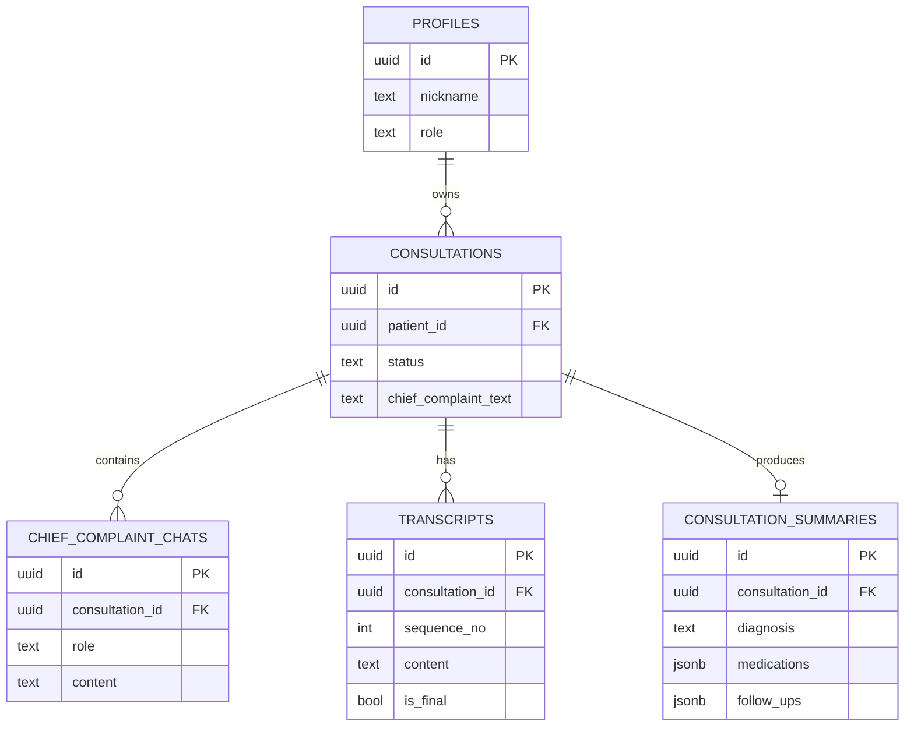
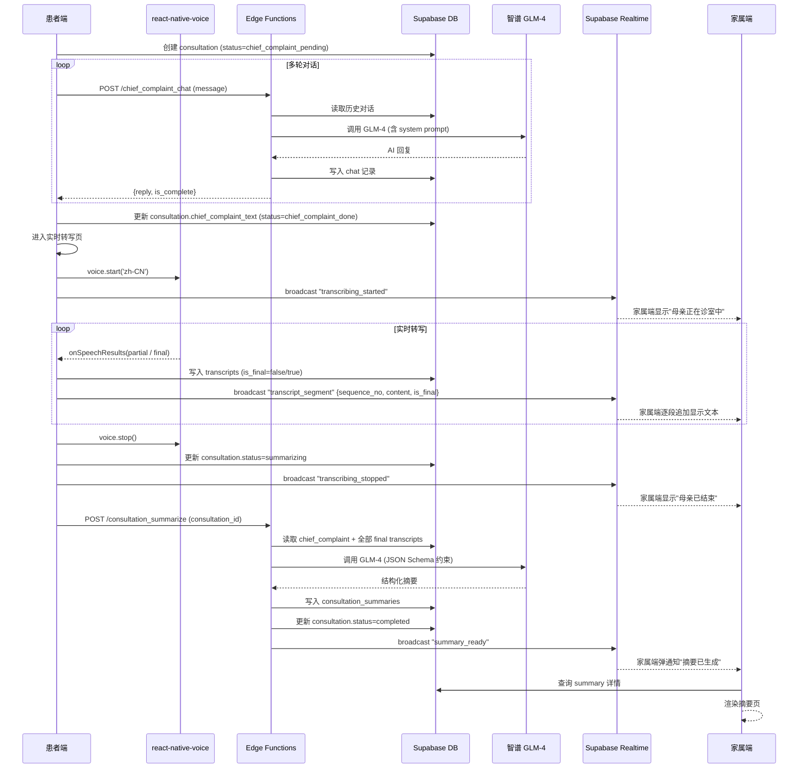
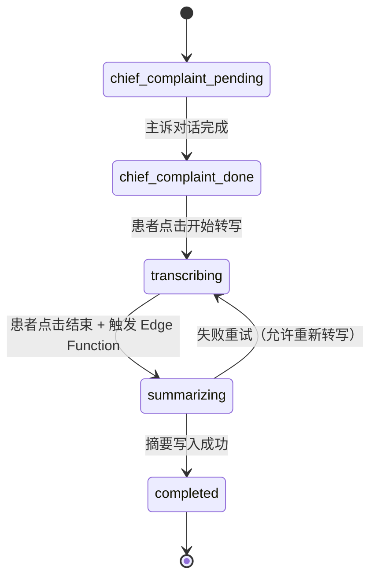

# ARCHITECTURE — 家庭AI陪诊师 MVP

## 1. 设计原则

- **够用就好**：10h 内跑通"患者主诉 → 实时转写 → 家属同步看到文本 → 收摘要"完整链路即视为成功
- **可演示 > 完整性**：评委关心 demo 体验，不关心是否覆盖 6 个功能
- **可迁移**：架构选型能在赛后平滑扩展为商用版，不推倒重来
- **延迟决策**：能用 mock 的不接真服务；能前端做的不开 Edge Function；能单端演示的不上多角色

架构不是一成不变的，可以随着项目发展逐步调整。

## 2. 技术栈选择与原因

### 2.1 移动端：Expo (React Native) + TypeScript

**为什么不是 Flutter**
- 黑客松场景下 RN + Expo 在 AI 编码助手语料丰富度、环境配置、热重载反馈上全面优于 Flutter
- Expo 生态成熟，商用上 App Store 完全可发布（Discord、Walmart、Coinbase 等用 RN）

**为什么 TypeScript 而不是 JavaScript**
- `strict: true` 模式下 AI 编码助手生成代码质量明显更高
- 类型错误在编译期暴露，节省 10h 内的调试时间
- 与 Supabase 自动生成的 DB 类型无缝衔接

### 2.2 路由：Expo Router

- 文件即路由，零配置
- 嵌套路由天然支持 `(patient)` / `(family)` 分组
- 上线后可平滑升级到 React Navigation 7

### 2.3 后端：Supabase（Auth + Postgres + Realtime + Edge Functions）

**为什么不是 Firebase**
- PostgreSQL 让医疗数据建模自然（关系型家庭与就诊数据）
- 行级权限（RLS）天然适配"家属 / 患者不同可见范围"
- 可平滑迁移到自托管，避免 Firebase 的 Google 云锁定

**为什么不是 SQLite**
- 多端（患者 + 家属）需共享数据，SQLite 是单机的
- 与 Auth / Realtime 同账户打通

> 注：MVP 阶段不使用 Supabase Storage（不存音频、头像用 emoji 字符）。

### 2.4 状态管理：TanStack Query + Zustand

| 类型 | 工具 | 用途 |
|---|---|---|
| 服务端数据 | TanStack Query | 就诊列表、摘要详情 |
| 实时数据 | Supabase Realtime | 家属端事件流 + 实时转写文本流 |
| 客户端 UI 状态 | Zustand | 当前角色、当前 consultationId、转写状态 |
| 表单临时状态 | `useState` | 主诉输入框 |

### 2.5 AI 服务

| 能力 | 选型 | 理由 |
|---|---|---|
| LLM | 智谱 GLM-4-Flash | 中文医疗语料强、API 稳定、合规清晰；Flash 版延迟低适合 10h demo |
| ASR | mosi.cn 多说话人转写（云端 API） | `POST /v1/audio/transcriptions`（model=moss-transcribe-diarize, diarize=true, stream=true SSE），说话人分离 S01=医生/S02=患者；客户端直连 demo 妥协（赛后迁服务端中转）。原方案 react-native-voice on-device 已弃用——医疗术语准确率与说话人分离需云端模型 |

> 演示阶段用 mock JSON 兜底，避免现场 LLM 抖动翻车；ASR 已接真实 mosi.cn 接口（MOSS_API_KEY 已配置即走真实）。

> ⚠️ ASR 依赖 `expo-av`（录音）+ `react-native-sse`（SSE 流式），均含原生模块，需运行 `npx expo prebuild` 切换到 Expo Development Build，无法用 Expo Go 扫码。MVP 阶段保留 30 分钟做 prebuild + native 首次构建。

## 3. 项目目录结构

```
ai_companion_app/
├── app/                              # Expo Router 文件即路由
│   ├── _layout.tsx                   # 根 layout，挂载全局 Provider
│   ├── index.tsx                     # 登录页
│   ├── role.tsx                      # 角色选择页
│   ├── (patient)/
│   │   ├── _layout.tsx               # 患者端 stack
│   │   ├── home.tsx
│   │   ├── chat.tsx
│   │   ├── transcription.tsx         # 实时转写页
│   │   └── summary.tsx
│   └── (family)/
│       ├── _layout.tsx               # 家属端 stack
│       ├── home.tsx
│       └── summary/[id].tsx
│
├── components/                       # 可复用 UI
│   ├── ui/                           # 基础原子：Button, Card, Input, Tag
│   ├── chat/                         # MessageBubble, ChatInput
│   ├── transcript/                   # TranscriptStream, TranscriptBubble
│   ├── summary/                      # MedicationList, FollowUpItem
│   └── common/                       # EmptyState, LoadingScreen
│
├── features/                         # 按业务领域封装
│   ├── auth/
│   │   ├── useAuth.ts                # 登录态 hook
│   │   └── authClient.ts             # Supabase Auth 封装
│   ├── consultation/
│   │   ├── types.ts                  # Consultation, ChiefComplaint 类型
│   │   ├── useConsultation.ts        # 当前就诊状态 hook
│   │   └── consultationApi.ts        # DB CRUD 封装
│   ├── chat/
│   │   ├── useChat.ts                # 多轮对话 hook
│   │   └── chatClient.ts             # 调 chief_complaint_chat Edge Function
│   ├── transcription/
│   │   ├── useLiveASR.ts            # 实时 ASR hook（按 ASR_USE_REAL 分流 mock/真实）
│   │   ├── asrClient.ts             # mosi.cn 转写封装：上传 + SSE 流式 + 同步降级
│   │   ├── useRecorder.ts           # expo-av 录音 hook
│   │   ├── asrPublisher.ts          # 转写片段写入 DB + Realtime 推送
│   │   └── mockASR.ts               # USE_MOCK 时定时推送预置片段
│   ├── summary/
│   │   ├── useSummary.ts
│   │   ├── summaryApi.ts             # DB 查询 + Realtime 订阅
│   │   └── summarizeClient.ts        # 调 consultation_summarize Edge Function
│   └── realtime/
│       ├── useFamilyFeed.ts          # 家属端订阅 Realtime channel
│       └── channels.ts               # channel 名约定
│
├── lib/
│   ├── supabase.ts                   # Supabase client 单例
│   ├── llmClient.ts                  # 智谱 GLM-4-Flash 直连封装（客户端 demo 妥协）
│   └── constants.ts                  # env、API URL、USE_MOCK/ASR_USE_REAL/LLM_USE_REAL 开关
│
├── hooks/
│   ├── useQuery.ts                   # TanStack Query 简化封装
│   └── useMutation.ts
│
├── store/
│   └── useAppStore.ts                # Zustand：当前角色、当前 consultationId
│
├── types/
│   └── database.ts                   # 从 Supabase 自动生成的 DB 类型
│
├── assets/
│   ├── images/
│   └── mock/                         # mock JSON
│       ├── sample-transcript-segments.json   # 数组，每段一条文本
│       └── sample-summary.json
│
├── supabase/                         # 后端工程（与前端同 repo）
│   ├── migrations/
│   │   └── 0001_init.sql
│   └── functions/
│       ├── chief_complaint_chat/
│       │   ├── index.ts
│       │   └── deno.json
│       ├── consultation_summarize/
│       │   ├── index.ts
│       │   └── deno.json
│       └── _shared/
│           ├── cors.ts
│           ├── llm.ts                 # 调 LLM 统一封装
│           └── supabase.ts
│
├── app.config.ts                     # Expo 配置（含 iOS Info.plist 权限声明）
├── package.json
├── tsconfig.json
└── .env.example
```

## 4. 核心模块划分

```
┌─────────────────────────────────────────────────────┐
│  UI 层 (app/ + components/)                          │
│  纯展示 + 用户交互，不直接调 API                       │
└────────────┬────────────────────────────────────────┘
             │ 调用
┌────────────▼────────────────────────────────────────┐
│  Feature 层 (features/)                             │
│  Hook + API Client 配对，封装业务逻辑                │
│  useChat / useLiveASR / useSummary 等              │
└────────────┬────────────────────────────────────────┘
             │ 调用
┌────────────▼────────────────────────────────────────┐
│  Infra 层 (lib/)                                    │
│  Supabase client / 常量                              │
└────────────┬────────────────────────────────────────┘
             │ HTTPS / WSS
┌────────────▼────────────────────────────────────────┐
│  Supabase (Auth + Postgres + Realtime)              │
│  + Edge Functions (chief_complaint_chat,           │
│    consultation_summarize)                           │
└─────────────────────────────────────────────────────┘
```

| 模块 | 职责 | 主要文件 |
|---|---|---|
| auth | 登录、登出、当前用户 | `features/auth/` |
| consultation | 就诊记录 CRUD、状态机 | `features/consultation/` |
| chat | 多轮主诉对话 | `features/chat/` |
| transcription | 实时 ASR + 转写片段推送 | `features/transcription/` |
| summary | 摘要生成、查询、家属订阅 | `features/summary/` + `features/realtime/` |
| ui | 基础组件库 | `components/ui/` |

## 5. 数据模型设计

### 5.1 核心表（5 张）

```sql
-- 1. 用户档案（扩展 Supabase auth.users）
create table public.profiles (
  id uuid primary key references auth.users on delete cascade,
  nickname text,
  avatar_url text,
  role text check (role in ('patient','family')),   -- 黑客松简化：当前登录态角色
  created_at timestamptz default now()
);

-- 2. 就诊记录
create table public.consultations (
  id uuid primary key default gen_random_uuid(),
  patient_id uuid references public.profiles(id) not null,
  status text not null check (
    status in ('chief_complaint_pending',   -- 待填主诉
               'chief_complaint_done',     -- 主诉完成
               'transcribing',             -- 实时 ASR 转写中
               'summarizing',              -- AI 摘要生成中
               'completed')                -- 摘要已生成
  ),
  chief_complaint_text text,               -- 结构化主诉文本
  created_at timestamptz default now(),
  updated_at timestamptz default now()
);

-- 3. 主诉对话
create table public.chief_complaint_chats (
  id uuid primary key default gen_random_uuid(),
  consultation_id uuid references public.consultations(id) on delete cascade,
  role text check (role in ('user','assistant','system')),
  content text not null,
  created_at timestamptz default now()
);

-- 4. 转写片段（实时 ASR 推送，每行一段）
create table public.transcripts (
  id uuid primary key default gen_random_uuid(),
  consultation_id uuid references public.consultations(id) on delete cascade,
  sequence_no int not null,                -- 片段顺序号
  content text not null,                   -- ASR 返回的文本片段
  is_final boolean default true,           -- false=partial 中间结果, true=final 终稿
  speaker text check (speaker in ('doctor','patient','family','unknown')),
  created_at timestamptz default now()
);

create index on public.transcripts (consultation_id, sequence_no);

-- 5. 就诊摘要
create table public.consultation_summaries (
  id uuid primary key default gen_random_uuid(),
  consultation_id uuid references public.consultations(id) on delete cascade,
  diagnosis text,                          -- 诊断
  doctor_advice text,                      -- 医嘱整理
  medications jsonb default '[]',         -- [{name, dosage, frequency, duration}]
  follow_ups jsonb default '[]',          -- [{type, time, description}]
  warnings text[] default '{}',            -- 注意事项
  created_at timestamptz default now()
);
```

### 5.2 RLS 策略（黑客松简化版）

```sql
-- 患者只能看自己的数据
alter table public.consultations enable row level security;
create policy "own_consultations" on public.consultations
  for all using (patient_id = auth.uid());

-- 同理 chief_complaint_chats / transcripts / consultation_summaries
-- 家属端访问用 service role key 绕过 RLS（hackathon only，赛后改为家庭关系表）
```

### 5.3 ER 图



## 6. 数据流

### 6.1 完整链路时序图



### 6.2 关键状态机



## 7. 后端与数据库

### 7.1 Edge Functions 清单（仅 2 个）

| 函数 | 用途 |
|---|---|
| `chief_complaint_chat` | 多轮主诉对话，调 GLM-4 |
| `consultation_summarize` | 接收 consultation_id → 读取 transcripts → 调 GLM 生成结构化摘要 |

### 7.2 Realtime channel 约定

| channel 名 | 事件 | 接收端 |
|---|---|---|
| `consultation:{id}` | `transcribing_started` | 家属端 |
| `consultation:{id}` | `transcript_segment` | 家属端 |
| `consultation:{id}` | `transcribing_stopped` | 家属端 |
| `consultation:{id}` | `summary_ready` | 家属端 |

### 7.3 Storage bucket

MVP 阶段不使用 Storage（无音频文件、无图片，头像用 emoji 字符）。赛后扩展时按需开通 `avatars`、`documents` 等 bucket。

## 8. Mock 数据策略

| 环节 | Mock 方式 | 备注 |
|---|---|---|
| 演示用患者账号 | 比赛前预注册 2 个测试账号 | demo 时直接登录 |
| 主诉对话首条 AI 提问 | 硬编码开场白 | LLM 抖动也能开场 |
| 实时 ASR 失败兜底 | 预置 `MOCK_TRANSCRIPT_SCRIPT` 数组（mockASR.ts），定时器每 1.5 秒推送一段 | 模拟实时转写效果。**注：MOSS_API_KEY 已配置后 ASR 走真实 mosi.cn 接口，mock 仅作未配 key 时兜底** |
| GLM 摘要失败兜底 | 预置 `sample-summary.json` | 一键切换 mock 模式 |
| 家属端历史通知 | mock 1 条"昨日已生成摘要" | 让家属端 home 不空 |
| 用户头像 | 用 emoji 字符代替图片 | 🧓 👩 |

### 实现方式

在 `lib/constants.ts` 加 `USE_MOCK` 常量。ASR 与 LLM 各有独立真实开关：

- `ASR_USE_REAL`：`MOSS_API_KEY` 已配置且非占位符时为 true，ASR 走真实 mosi.cn
- `LLM_USE_REAL`：`ZHIPU_API_KEY` 已配置且非占位符时为 true，LLM 走真实智谱 GLM

`useLiveASR` hook 按 `ASR_USE_REAL` 分流——mock 模式定时器推送预置片段，真实模式录音→上传→SSE 流式接收：

```typescript
// features/transcription/useLiveASR.ts
// start() 按 ASR_USE_REAL 分流：
//   mock  → startMockASR() 定时推送 MOCT_TRANSCRIPT_SCRIPT
//   real → recorder.startRecording() (expo-av) → stopReal() 上传 mosi.cn → SSE 流式

// features/chat/chatClient.ts、features/summary/summarizeClient.ts
// 按 LLM_USE_REAL 分流：mock 返回预置脚本/摘要，real 调 lib/llmClient.ts (智谱 GLM-4-Flash)
```

> LLM 真实调用封装在 `lib/llmClient.ts`（客户端直连 demo 妥协）；架构正确的服务端中转版本在 `supabase/functions/`（赛后切换，见 §7.1）。

## 9. 代码规范

### 9.1 TypeScript 严格模式

`tsconfig.json` 开 `strict: true`，所有公开函数带类型签名。

### 9.2 命名约定

| 类型 | 约定 | 示例 |
|---|---|---|
| 文件名 | kebab-case | `chief-complaint-chat.ts` |
| React 组件 | PascalCase | `MessageBubble.tsx` |
| Hook | camelCase + `use` 前缀 | `useChat.ts` |
| 类型 | PascalCase | `Consultation`, `ChiefComplaint` |
| 常量 | UPPER_SNAKE | `MAX_CHAT_ROUNDS` |
| DB 表名 | snake_case 复数 | `consultations`, `transcripts` |
| Edge Function 名 | snake_case | `chief_complaint_chat` |

### 9.3 文件分层原则

- `app/` 只放页面与路由，业务逻辑全放 `features/`
- `components/ui/` 是无业务依赖的原子组件，可跨项目复用
- `features/<name>/` 内部高内聚，跨 feature 通过 hook 暴露，避免直接互引

### 9.4 注释与文档

- 函数级别注释用 JSDoc 格式
- 复杂业务逻辑（状态机、Edge Function 编排）用中文行内注释说明意图
- 不要给显而易见的代码加注释

### 9.5 环境变量

```bash
# .env.example
EXPO_PUBLIC_SUPABASE_URL=...
EXPO_PUBLIC_SUPABASE_ANON_KEY=...
ZHIPU_API_KEY=...           # 仅在 Edge Function 服务端使用
USE_MOCK=false
```

前端只用 `EXPO_PUBLIC_` 前缀变量，敏感 key 全部在 Edge Function 服务端。

## 10. 扩展空间与不做的事

### 10.1 留出的扩展空间

| 设计 | 扩展用途 |
|---|---|
| `consultation_summaries.medications` 用 `jsonb` | 赛后要拆分药品库可平滑迁移 |
| `chief_complaint_chats` 表保留多轮对话 | 未来加 AI 提醒功能直接复用 |
| Realtime channel 用 `consultation:{id}` 命名 | 未来加直播间聊天不冲突 |
| Edge Function 拆分 `_shared/llm.ts` | 未来换 LLM 厂商只改一处 |
| `transcripts` 表带 `is_final` / `sequence_no` 字段 | 未来换讯飞医疗 ASR 流式版可直接复用 |
| on-device ASR 抽象为 `useLiveASR` hook | 未来切流式 ASR 只改一处实现，不影响 UI |

### 10.2 明确不做的事

| 不做的事 | 理由 |
|---|---|
| 家庭关系表（多成员多角色） | 用 `patient_id` + service role 绕过 RLS |
| 微信 / Apple Sign In | 审核与商务对接超 48h |
| 音频录制与文件存储 | 本次 demo 决策：仅做实时 ASR，不存音频 |
| 病历语义检索（pgvector） | 历史档案功能已砍 |
| 实时 AI 追问建议 | 简化为"实时转写 + 摘要"两步 |
| 诊室直播间音视频 | 简化为家属端事件流 |
| 后台管理 | 不做 |
| 数据导出 | App Store 强制项，但黑客松不做 |

## 11. 推进顺序

按下面顺序写代码，每步完成都能演示：

1. 登录页 + 角色选择页（1h）
2. 患者主页 + 创建 consultation（0.5h）
3. `chief_complaint_chat` Edge Function + 患者对话页（2h）
4. `npx expo prebuild` + react-native-voice 集成 + 实时转写页（2.5h）
5. `consultation_summarize` Edge Function（1.5h）
6. 家属主页 + Realtime 订阅 + 实时文本流（1.5h）
7. 家属摘要详情页（1h）
8. Mock 与降级开关 + UI 美化（剩余时间）

合计约 10h，含 30 分钟 prebuild + native 首次构建 buffer。

## 12. 文档维护

每次代码变更需同步更新本文件相关章节：

| 变更类型 | 更新章节 |
|---|---|
| 新增 / 替换技术栈 | §2 + README |
| 新增 / 调整项目结构 | §3 + README |
| 新增 / 修改数据表 | §5 + ER 图 |
| 新增 Edge Function | §7.1 |
| 新增 channel 事件 | §7.2 |
| Mock 替换为真实服务 | §8 |
| 新增模块 | §4 |
| 调整状态机 | §6.2 |

### 变更记录

| 版本 | 日期 | 变更摘要 |
|---|---|---|
| v0.1 | 2026-08-27 | 黑客松 MVP 初版，定义 5 张表 / 2 个 Edge Function / 3 个 Realtime 事件 |
| v0.2 | 2026-08-27 | 取消诊中录音，改 on-device ASR 实时转写；`transcripts` 表去掉 `audio_path`，加 `is_final` / `sequence_no`；状态机简化为 5 态；推进顺序压缩到 10h；新增 `transcript_segment` Realtime 事件 |
| v0.3 | 2026-08-28 | ASR 改 mosi.cn 云端多说话人转写（弃 react-native-voice）：录音用 expo-av，SSE 用 react-native-sse，§2.5/§8 同步；新增 `ASR_USE_REAL`/`LLM_USE_REAL` 独立开关；LLM 真实接入智谱 GLM-4-Flash（lib/llmClient.ts 直连）；建 `supabase/functions/` Edge Function 工程（chief_complaint_chat / consultation_summarize + _shared）作为服务端中转备选 |
| v0.4 | 2026-08-28 | 比赛版 Agent 叙事重构：3 个 AI 调用包装为 3 个 Agent 角色（主诉澄清 / 语音转写 / 摘要生成），每个 Agent 含「数据来源 → 算法逻辑 → 工具调用 → 结构化输出」四件套；UI 完全去掉"录音"概念词统一为"语音识别"；新增 §13 Agent 协作架构；配套产出 `docs/diagrams/` 4 个图文件（HTML+MD）+ `docs/pitch-script.md` 8 分钟逐字稿 |

## 13. Agent 协作架构（比赛版叙事）

> 本章用于比赛 PITCH 与评委沟通，把 §4 核心模块 + §6 数据流包装为 **3 Agent 串联叙事**。代码层不引入新依赖，沿用 §4 features/* 现有结构，仅重构呈现方式。

### 13.1 3 Agent 职责拆解

| Agent | 阶段 | 算法逻辑 | 工具/调用 | 输入 | 输出 | 实现位置 |
|---|---|---|---|---|---|---|
| **Agent 1 · 主诉澄清** | 诊前 | 多轮提问 5 轮 + `response_format=json_object` + schema 字段兜底 | GLM-4-Flash `chatComplete` + `chatJSON` | 患者主诉文本 | `ChiefComplaint` | `features/chat/chatClient.ts` |
| **Agent 2 · 语音转写** | 诊中 | 说话人分离（S01=医生/S02=患者）+ SSE 流式逐段返回 + m4a 上传 → file_id → SSE | mosi.cn `moss-transcribe-diarize` + expo-av 采集 | 医生/患者语音流 | 分段转写文本 `{speaker, text, start, end}[]` | `features/transcription/asrClient.ts` + `useRecorder.ts` |
| **Agent 3 · 摘要生成** | 诊后 | `ConsultationSummary` schema + 药品/复诊提取 + 数组字段强制类型转换 | GLM-4-Flash `chatJSON` | Agent 2 输出转写文本 | `ConsultationSummary` | `features/summary/summarizeClient.ts` |

### 13.2 数据来源

| 数据源 | 用途 | 处理 Agent |
|---|---|---|
| 患者主诉文本（键盘输入） | 多轮追问 + 结构化主诉 | Agent 1 |
| 医生/患者语音流（麦克风采采集 m4a） | 多说话人分离 + SSE 流式转写 | Agent 2 |
| Agent 2 输出转写文本 | 结构化摘要生成 | Agent 3 |
| mock 病史记录 | 暂未实现，赛后接入 | — |

### 13.3 协作流程（状态机推进）

`consultation.status` 推进即 Agent 协作交接：

```
chief_complaint_pending → chief_complaint_done → transcribing → summarizing → completed
        ↓                         ↓                       ↓                ↓
     Agent 1                   Agent 1 完成              Agent 2         Agent 3
     主导                     触发 Agent 2              主导            主导 → 推送家属端
```

每个状态对应一个 Agent 主导，状态推进 = Agent 交接。

### 13.4 双端实时同步

| 通道 | 当前实现 | 赛后升级 |
|---|---|---|
| 患者端 → 家属端转写文本 | `asrPublisher` → mockStore 订阅 | Supabase Realtime channel `consultation:{id}` |
| 摘要完成通知 | mockStore 写入触发 | Realtime broadcast `summary_ready` |

### 13.5 比赛版架构图

完整图源见 [`docs/diagrams/agent-architecture.md`](./docs/diagrams/agent-architecture.md) 与 [`docs/diagrams/safety-results.md`](./docs/diagrams/safety-results.md)（含 HTML 版可直接嵌 PPT）。

### 13.6 焦点

每个 Agent 内含「数据来源 → 算法逻辑 → 工具调用 → 结构化输出」四件套。3 Agent 横向串联 + 状态机推进 + 双端实时同步 = 比赛版主架构。

> 注：当前为单线性状态机驱动，非多 Agent 自主编排。未来 v1.0 演进可引入 `lib/agentRouter.ts` 根据上下文动态调度 Agent，现有 chatClient/asrClient/summarizeClient 沉为 Agent 内部工具调用。
