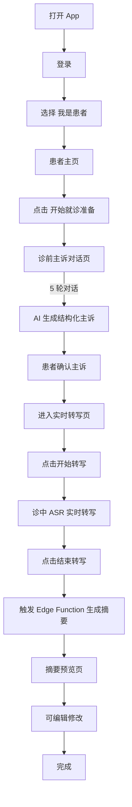
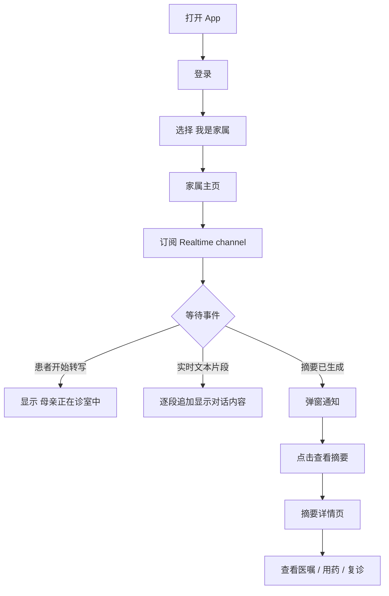

# PRD — 家庭AI陪诊师 MVP

## 1. 产品定位

**一句话定位**：AI 驱动的家属远程陪诊平台，让不在身边的家属也能全程安心参与患者就医。

**核心问题**
- 31–40 岁子女中，29.7% 与父母异地，42.6% 同城不同住，合计超七成不与父母同住
- 子女无法每次亲自陪诊，但情感上深度想参与
- 父母就诊时说不清症状、记不住医嘱、回家后忘记复诊时间是常态

**核心价值**
用 AI 填补"家属想陪患者但无法在场"的空白，覆盖诊前准备 → 诊中记录 → 诊后管理与主动推送全流程，以情感连接（安心 / 内疚缓解）为驱动，以全程伴诊为付费基础。

## 2. 目标用户

| 维度 | 描述 |
|---|---|
| 主付费用户 | 31–40 岁子女（80 后，占比 71.2%） |
| 主使用者 | 61–70 岁父母（占比 55.8%） |
| 关系分布 | 子女与父母异地 29.7%，同城不同住 42.6% |
| 拓展群体 | 夫妻、独居者、老人儿童等 |

## 3. MVP 功能列表

黑客松 10 小时范围内只做以下 3 个核心功能，详见 §5 范围决策。

### 功能 A：诊前整理主诉（简化版）

**目标**：通过多轮 AI 提问，帮助老年患者在 5 轮对话内说清症状，输出结构化主诉。

**关键规则**
- AI 角色：医疗问诊助手，目标是 5 轮内归纳出主诉
- 输出格式：`{ 主诉, 主要症状[], 持续时间, 严重程度 }`
- 每轮对话存入 `chief_complaint_chats` 表，断网可恢复
- 完成后写入 `consultations.chief_complaint_text`

### 功能 B：诊中实时语音转文字

**目标**：患者在诊室开口说话即可，App 通过 on-device ASR 实时把语音转成文字，文本同步展示给患者与家属。

**关键规则**
- 患者点击"开始转写"即视为同意语音识别（无音频文件存储）
- 调用 react-native-voice（iOS Speech / Android SpeechRecognizer）做实时识别
- 每段识别结果（partial / final）实时写入 `transcripts` 表 + 推送 Realtime channel
- 患者端实时展示累计文本；家属端订阅同一 channel 看到文本逐段出现
- 演示可用预置文本片段定时器模拟实时转写效果兜底

### 功能 C：诊后摘要 + 主动推送家属

**目标**：AI 基于主诉 + 累积转写文本，生成结构化就诊摘要，主动推送给家属。

**关键规则**
- 摘要结构：`{ 诊断, 医嘱整理, 用药[], 复诊提醒[], 注意事项[] }`
- 用药与复诊用 JSON Schema 约束 LLM 输出
- 摘要底部强制标注："AI 整理仅供参考，请以医嘱原件为准"
- 通过 Supabase Realtime broadcast 推送到家属端 channel
- 家属端收到通知 → 跳转摘要详情页查看

## 4. 用户使用流程

### 4.1 患者流程

### 4.2 家属流程

## 5. 范围决策

### 5.1 不在 MVP 范围内

| 功能 | 决策理由 |
|---|---|
| 推荐医生挂号 | 依赖医院挂号平台开放 API，国内接入门槛高 |
| 诊室直播间音视频 | 需声网 Agora 接入与弱网降级，48h 不可行 |
| AI 实时追问建议 | 简化为"实时转写 + 摘要"两步，跳过实时建议 |
| 日常健康记录 | 不影响核心 demo 链路 |
| 病历语义检索（pgvector） | 历史档案功能未做 |
| 微信 / Apple Sign In | 审核与商务对接超 48h |
| 音频录制与文件存储 | 本次 demo 决策：仅做实时 ASR，不存音频 |
| 数据导出 / 账号注销 | App Store 强制项，黑客松不做 |

### 5.2 简化策略

| 环节 | 简化方式 |
|---|---|
| 角色系统 | 单 App 内切换"我是患者 / 我是家属"，不做多账号绑定 |
| 推送通知 | 用 Supabase Realtime 模拟，跳过 APNs / 个推 |
| ASR | 用 react-native-voice on-device ASR，实时转写；不录音不存音频 |
| 家庭关系 | 用 `patient_id` + service role key 绕过 RLS，赛后补家庭关系表 |
| 真实数据 | 演示用预置文本片段定时器模拟实时 ASR + mock 摘要兜底 |

## 6. 商业模式与未来路径

### 6.1 商业模式假设

- 付费方：子女（情感驱动 + 内疚缓解）
- 付费基础：全程伴诊（诊前 → 诊中 → 诊后）订阅制
- 价格假设：99 元 / 月（含 3 次完整就诊流程），单次 39 元（待验证）

### 6.2 赛后演进路径

| 阶段 | 在 MVP 基础上做什么 |
|---|---|
| 1 个月 | 加微信 OAuth + Apple Sign In；接入智谱企业账号 |
| 2–3 个月 | react-native-voice → 讯飞医疗 ASR 流式版（医疗术语准确率提升）；接入声网做真诊室直播间 |
| 4 个月 | 接 APNs / 个推 / FCM 真推送；补全日常健康记录与历次档案 |
| 5 个月 | 上架 App Store（隐私政策、Apple Sign In、数据导出入口必备） |

代码 80% 可复用，主要是替换底层服务（react-native-voice → 讯飞医疗 ASR、Realtime 假推送 → 真推送）。

## 7. 演示要点（评委视角）

| 演示动作 | 情感锚点 |
|---|---|
| 患者点击"开始就诊准备" → AI 耐心多轮提问 | "爸妈说不清症状" → AI 帮忙说清 |
| 患者开口说话 → 转写文本逐段出现 → 家属端同步看到 | "医生说话快记不住" → 实时记录，家属同步看到 |
| 家属端弹"摘要已生成" | "我远在他乡也能马上知道医嘱" |
| 家属查看用药与复诊提醒 | "下次复诊不会忘" |
| 摘要底部标注"仅供参考" | 安全感与边界感 |

## 8. 文档维护

本 PRD 描述 MVP 范围。新增功能时：
- 在 §3 添加功能列表
- 在 §4 添加对应流程图
- 在 §5 调整"不在 MVP 范围内"列表
- 商业模式变化时同步更新 §6

每次发布版本号 +1，记录变更摘要到本文件末尾。

### 变更记录

| 版本 | 日期 | 变更摘要 |
|---|---|---|
| v0.1 | 2026-08-27 | 黑客松 MVP 初版，定义功能 A/B/C 与范围决策 |
| v0.2 | 2026-08-27 | 取消诊中录音，改为 on-device ASR 实时转写；更新流程与范围决策；演示时间从 48h 压缩到 10h |
